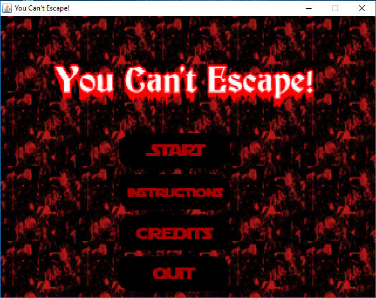
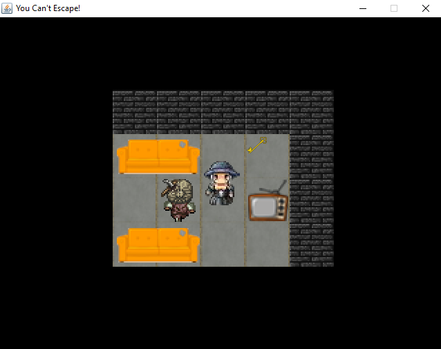

# You Can't Escape
IF2210 Tugas Besar 3 Pemrograman Berorientasi Objek

### Overview
A simple horror minigame based on Java Swing

The objective is to escape from the haunted house. The player needs to collect keys to advance locked doors and finds the exit. However, the player has limited vision because the haunted house is dark. In addition, there are many ghosts reside in the house and will kill the player when they touch the player.


### Execute
```
1. cd v02
2. java -cp bin ghostgame.Launcher
```
### Contributors
13515057 - Erick Wijaya

13515078 - Veren Iliana

13515087 - Kevin Iswara

13515111 - Catherine Almira

## Screenshot




